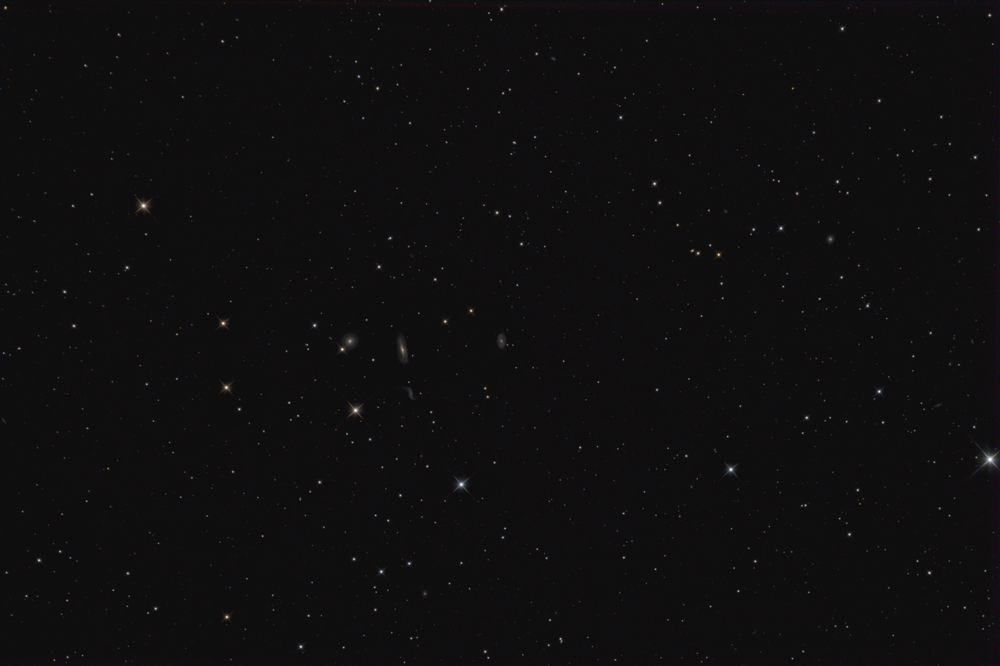

# Arp 316 Galaxy Group: Unprocessed one-shot color subframes

Some sample data for processing with [Nightlight](https://github.com/mlnoga/nightlight). Final curve adjustment was performed in [Gimp](https://www.gimp.org/). 

## Subexposures

| Session | Subexposures | Duration per subexposure| Total duration |
|---------|--------------|-------------------------|----------------|
|1        |31  | 299s   | 2h 34 min |
|2        |36  | 299s   | 2h 59 min |
|3        |27  | 299s   | 2h 14 min |
|4        |36  | 299s   | 2h 59 min |
|Total    |130 | 299s   | 10h 47 min |

* Image size is 6016 x 4016, or 24 Megapixels
* Storage size is 16 bits per pixel, or 46 MiB uncompressed and some 25 MiB compressed
* Image scale is tbd arcseconds/pixel

## Equipment

| Item     | Description |
|----------|-------------|
| Camera   | Nikon D7200 with ISO 200 |
| Telescope| tbd |
| Filters  | tbd |
| Guider   | tbd |
| Mount    | tbd | 
| Time     | tbd |
| Location | tbd |

## License

This dataset is Copyright (C) 2020 by Steffen S and Markus Noga. All rights reserved.

It is licensed under [CC BY-NC-SA 4.0CC](https://creativecommons.org/licenses/by-nc-sa/4.0).
